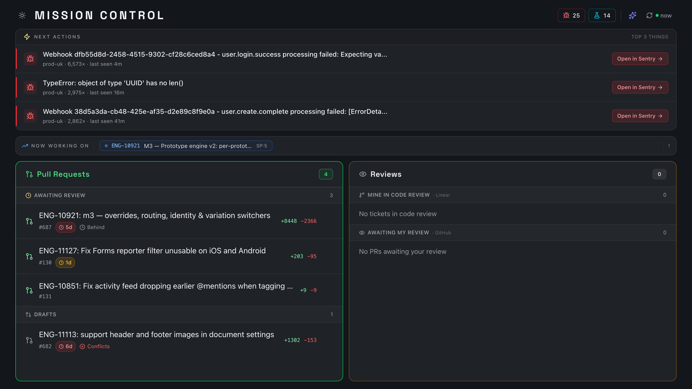
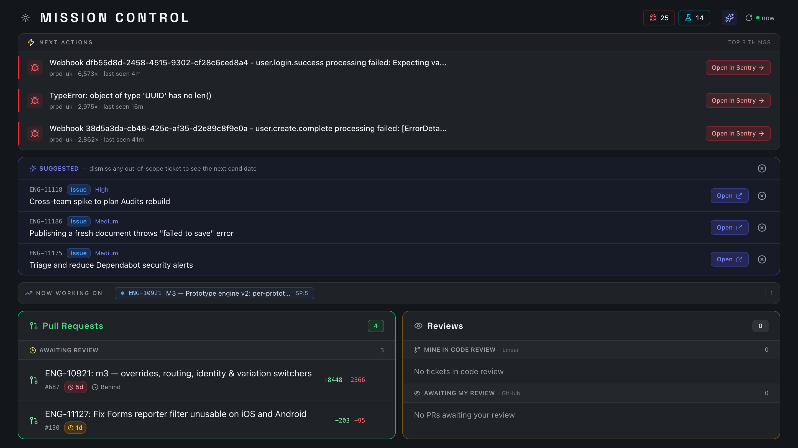
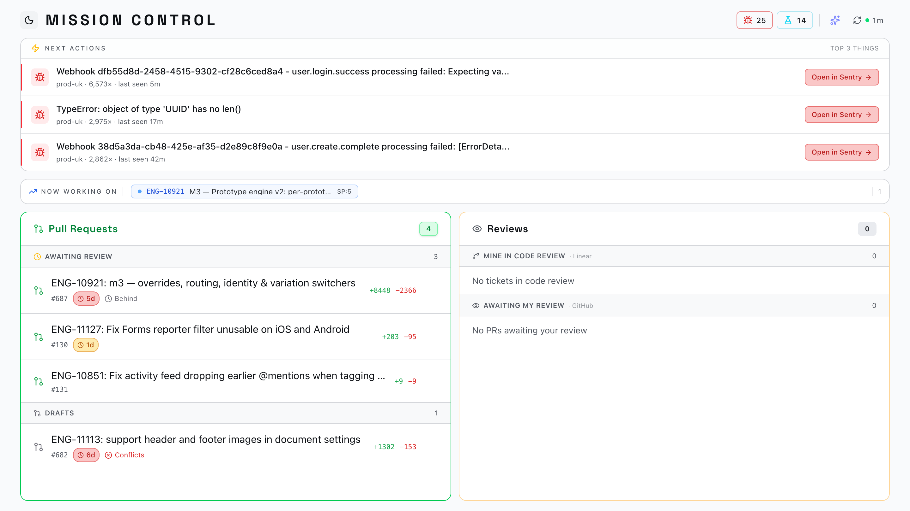

<div align="center">


# MISSION CONTROL

### One pane of glass for your PRs, reviews, tickets, and production errors.

Aggregates **GitHub**, **Linear**, and **Sentry** into a single, fast dashboard so you can see what needs your attention without tab-hopping.

<br />

[](https://react.dev)
[](https://vite.dev)
[](https://www.typescriptlang.org)
[](https://tailwindcss.com)
[](https://fastify.dev)
[](https://pnpm.io)
[](https://turbo.build)

</div>

---

<div align="center">



<sub><em>Top errors, what you're working on, open PRs and pending reviews — at a glance.</em></sub>

</div>

---

## What it does

> Stop bouncing between five tabs to figure out what to work on next.

- **Sentry triage** — the loudest production errors ranked by volume × recency, per environment (`prod-uk`, `stage`).
- **Now working on** — your active Linear ticket, always in view.
- **Pull requests** — everything awaiting review (plus drafts), with diff size, staleness, and merge-conflict flags.
- **Reviews** — PRs waiting on *you*, and your own tickets sitting in code review.
- **Suggest next ticket** — surfaces the best candidates to pick up next; dismiss anything out of scope to reveal the next.
- **Light & dark** — because of course.

<table>
  <tr>
    <td width="50%"></td>
    <td width="50%"></td>
  </tr>
  <tr>
    <td align="center"><sub><b>“Suggest next ticket”</b> — ranked pickup candidates</sub></td>
    <td align="center"><sub><b>Light theme</b> — same data, brighter room</sub></td>
  </tr>
</table>

## Architecture

```
┌─────────────┐      ┌──────────────────┐      ┌──────────────┐
│  packages/  │ HTTP │   packages/      │ API  │   GitHub     │
│    web      │─────▶│    server        │─────▶│   Linear     │
│ React 19 UI │◀─────│  Fastify proxy   │◀─────│   Sentry     │
└─────────────┘      └──────────────────┘      └──────────────┘
        ▲                     │
        └── packages/shared ──┘   (shared types + API clients)
```

| Package | Stack | Role |
| --- | --- | --- |
| `packages/web` | React 19 · Vite · Tailwind v4 · shadcn/Radix · Zustand | The dashboard UI |
| `packages/server` | Fastify | Proxies & normalizes GitHub / Linear / Sentry |
| `packages/shared` | TypeScript | Shared types and API clients |

## Quick start

```bash
git clone <repo-url> mission-control
cd mission-control
cp .env.example .env          # fill in the values (see below)
pnpm install
pnpm dev
```

> Web → **http://localhost:5173**  ·  Server → **http://localhost:4000**

### Prerequisites

- **Node.js 20+** (see `.nvmrc`)
- **pnpm 9+** — `npm install -g pnpm`
- A local checkout of the platform repo your agents will operate on

## Environment variables

All vars live in a single `.env` at the repo root. See `.env.example` for the full list.

| Variable | How to get it |
| --- | --- |
| `PLATFORM_DIR` | Absolute path to your local platform repo checkout. The server uses this as the working directory for Claude agents. |
| `GITHUB_PERSONAL_ACCESS_TOKEN` | Create at https://github.com/settings/tokens with `repo` and `read:user` scopes. |
| `LINEAR_API_KEY` | Personal API key from https://linear.app/settings/api |
| `SENTRY_ACCESS_TOKEN` | Auth token from https://sentry.io/settings/account/api/auth-tokens/ |
| `SENTRY_ORG` / `SENTRY_PROJECT` | Your Sentry org and project slugs |
| `PORT` | Server port (defaults to `4000`) |

## Scripts

Run these from the **repo root** (not from inside `packages/` or a sub-package).

| Command | What it does |
| --- | --- |
| `pnpm dev` | Run web + server together (turbo) |
| `pnpm dev:web` | Web only |
| `pnpm dev:server` | Server only |
| `pnpm build` | Build all packages |

## Troubleshooting

- **`PLATFORM_DIR: (not set)`** in server logs — fill in `PLATFORM_DIR` in `.env` and restart.
- **CORS errors in browser** — the server only allows `localhost` / `127.0.0.1` origins; make sure the web app is on one of those.
- **Stale lockfile** — delete `node_modules` and `pnpm-lock.yaml`, then re-run `pnpm install`.

<div align="center">
<br />
<sub>Built for humans who'd rather ship than tab-hop.</sub>
</div>
